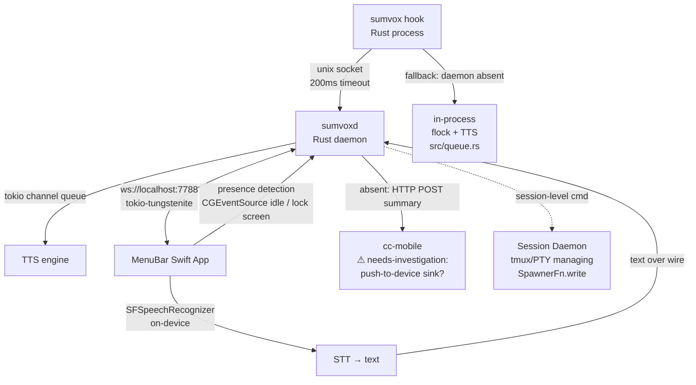

> **superseded**: 本文件已由 `openab-aggregator.md` 取代，請以該文件為現行設計基準。

# SumVox Agent Aggregator — Design Analysis

## Overview

SumVox 目前以 stateless fire-and-forget 模式運作：每個 Claude Code session 結束後 hook 直接 in-process 執行 LLM 摘要→TTS。兩個核心痛點：(1) 多 session 並行語音重疊；(2) 使用者不在時摘要無人收聽。

本文件設計一個有狀態 Rust daemon，作為唯一音訊輸出與全域狀態擁有者，並搭配 macOS 選單列 Swift app（視覺分身）與可選的 cc-mobile push 管道。

---

## 1. Queue/Flock/Daemon 遷移（E1）

### 現況

`src/queue.rs` 透過 `NotificationQueue` 與 `QueueLock`（`nix::fcntl::Flock` RAII wrapper）在 `~/.sumvox/queue.lock` 做跨 process flock 協調。每個 hook invocation 都是獨立 process，靠 flock exclusive lock 排隊，確保 TTS 不重疊。

### 遷移策略

引入常駐 `sumvoxd` daemon（以 SumVox crate 為 lib），持有 in-process async queue（tokio channel），成為唯一 TTS 輸出者。Daemon 直接 **replace**（取代）`NotificationQueue`/`QueueLock` 的跨 process 協調角色；換言之，daemon **wrap** 並 **supersede** 了 `src/queue.rs` 的 flock 機制，由 tokio channel 在 daemon 內部做序列排程。

### Daemon-Absent Fallback

當 hook 嘗試連線 daemon socket 失敗時（connect-refused），降級回今天既有的 in-process flock+TTS 路徑（即 `NotificationQueue` + `QueueLock` + 直接呼叫 TTS engine），行為與現有版本一致。此 fallback 確保 daemon 未啟動時 hook 仍可運作。

```
hook (Rust process)
  ├─ try connect unix socket
  │     ├─ OK  →  send event to daemon  →  daemon queue → TTS
  │     └─ FAIL (daemon absent / connect-refused)
  │           →  fallback: in-process flock + TTS  (src/queue.rs 現有邏輯)
```

**預設**：daemon 自持 in-process async queue；flock 僅作 daemon-absent fallback。

---

## 2. Hook→Daemon 事件契約（E2）

### Wire Payload

Payload 直接由 `ClaudeCodeInput` 欄位導出，newline-delimited JSON over Unix domain socket（UDS）：

```jsonc
{
  "session_id": "<ClaudeCodeInput.session_id>",
  "transcript_path": "<ClaudeCodeInput.transcript_path>",
  "hook_event_name": "<ClaudeCodeInput.hook_event_name>",
  "stop_hook_active": true | false | null,
  "message": "<ClaudeCodeInput.message>",
  "notification_type": "<ClaudeCodeInput.notification_type>",
  "last_assistant_message": "<ClaudeCodeInput.last_assistant_message>"
}
```

欄位語意與 `ClaudeCodeInput` struct（`src/hooks/claude_code.rs:19-31`）完全對應，無額外轉換。

### 傳輸規格

| 項目 | 值 |
|------|-----|
| Socket 路徑 | `~/.sumvox/daemon.sock` |
| 格式 | newline-delimited JSON（每則事件一行，`\n` 結尾） |
| Connect timeout | **200ms**（超時即視為 daemon absent，觸發 fallback） |
| Daemon-absent fallback 觸發 | connect-refused 或 connect timeout（200ms）→ inline in-process 執行 |

### Cargo.toml 異動

Daemon 端需要 Unix socket 監聽，須為 tokio 加入 `net` feature：

```toml
# Cargo.toml:15
tokio = { version = "1", features = ["rt-multi-thread", "macros", "fs", "io-util", "process", "net"] }
```

目前 `Cargo.toml:15` 缺少 `net`，此為必要 net feature 新增。

---

## 3. Daemon↔Swift 選單列 App（E3）

### 架構

macOS 選單列 Swift app（視覺分身）透過 localhost WebSocket 與 daemon 雙向通訊。Daemon 端使用 **tokio-tungstenite** websocket crate 提供 WebSocket server。

```
sumvoxd  ←——— ws://localhost:7788 ———→  MenuBarApp.swift
```

### 訊息 Schema

**Daemon → UI（state push 狀態推送）**

```jsonc
// queue 狀態
{ "type": "queue_state", "depth": 2, "current_session": "sess-abc" }

// session registry
{ "type": "session_registry", "sessions": [{ "id": "sess-abc", "started_at": "..." }] }

// presence 狀態
{ "type": "presence", "state": "present" | "absent", "idle_secs": 42 }
```

**UI → Daemon（command 指令）**

```jsonc
{ "type": "mute",   "duration_secs": 300 }
{ "type": "replay", "session_id": "sess-abc" }
{ "type": "push_to_talk_start" }
{ "type": "push_to_talk_end",  "text": "<STT 辨識結果>" }
```

### 依賴新增

```toml
tokio-tungstenite = { version = "0.23", features = ["native-tls"] }
```

---

## 4. Presence/Routing（E4）

### 在場偵測

偵測邏輯**在 Swift 端**執行，透過 macOS 原生 API：

- `CGEventSourceSecondsSinceLastEventType`：取得自上次使用者輸入事件後的 idle 秒數
- 鎖屏偵測：`NSWorkspaceSessionDidResignActiveNotification` / `com.apple.screenIsLocked` 分散式通知

**門檻（threshold）**：idle 超過 **300 秒**（5 分鐘）或鎖屏，判定為 absent。

Swift app 定期（每 30s）偵測後，透過 WebSocket 推送 `presence` 狀態給 daemon。

### 路由表

| 狀態 | 動作 |
|------|------|
| present（在場） | 本機 TTS 立即播放（走 daemon in-process queue） |
| absent（不在） | 停止本機 TTS；留存摘要；送 cc-mobile push（見 E5） |

---

## 5. CC-Mobile Push（E5）

### Absent 摘要送達流程

1. Daemon 偵測到 presence = absent（來自 Swift WebSocket 推送）
2. LLM 摘要完成後，daemon 將摘要存至本機 `~/.sumvox/pending/`（留存）
3. Daemon 透過 HTTP POST 嘗試推送 summary 到 cc-mobile server

```
POST http://cc-mobile-server/api/sumvox/summary
{ "session_id": "...", "summary": "...", "timestamp": "..." }
```

**needs-investigation**：cc-mobile 是否有 push-to-device（web-push/APNs/FCM）sink 可在 app 未開啟時推送到裝置，還是只有 app 開啟時的 live-WS 接收？目前架構假設 live-WS，若 cc-mobile 無 push-to-device sink，absent 時的摘要只能在使用者下次開啟 cc-mobile 時才能看到。此問題須在 M2 里程碑前確認。

---

## 6. 語音指令分層（E6）

### 架構圖

```
語音輸入（Swift STT）
        │
        ▼
  ┌─────────────────────────────────────────┐
  │  daemon-level 指令（daemon 內處理）       │
  │  • mute / unmute                        │
  │  • replay <session>                     │
  │  • cross-session summary                │
  └─────────────────────────────────────────┘
        │ (session 級指令轉發)
        ▼
  ┌─────────────────────────────────────────┐
  │  session-level 指令（獨立 session daemon）│
  │  • 叫 session 繼續 / 停下               │
  │  • 回寫機制：PTY stdin inject           │
  └─────────────────────────────────────────┘
```

### Daemon 級（daemon-level）

`mute`、`replay`、跨 session 摘要等，全在 sumvoxd 內部處理，不依賴任何外部 session 管理。

### Session 級（session-level）

Session 級指令（如「繼續」「停下」）需要向特定 terminal session 注入鍵盤輸入。回寫機制設計為**獨立的 tmux/PTY-managing session daemon**，從 cc-mobile 的 `pty-driver.ts` 中 `SpawnerFn.write`（「injects bytes as if typed at the keyboard」）抽出此能力，獨立成一個不耦合 cc-mobile 的 Rust/Node service。

**硬前提**：只有由 session daemon **spawn** 的 session 可被驅動（drivable）；使用者直接在終端機開啟的 session 無法注入 stdin，無可驅動。

**決策 C（Decision C）**：先設計並完整實作 daemon-level 語音指令層；session 級當可選轉接層，待 session daemon 獨立後接入。cc-mobile 維持次要推送管道，不進入 session 控制主路徑。

---

## 7. 里程碑（E7）

每個里程碑各有單一 observable acceptance handle，對映痛點或決策。

| 里程碑 | 目標 | Acceptance（可觀測驗收條件） |
|--------|------|-------------------------------|
| **M1** | 多 session 並行音訊序列化 | 兩個並行 session 同時結束時，TTS 播放嚴格序列、非重疊；可用秒錶量測兩段音訊無交疊 |
| **M2** | Absent 時零本機音訊 + cc-mobile 留存 | 偵測到 absent 後，本機無任何 TTS 輸出，且 `~/.sumvox/pending/` 寫入一筆摘要並有 cc-mobile POST log |
| **M3** | Daemon 狀態→UI 反映 | Daemon queue depth 或 presence 變化後，選單列 Swift app 在 1s 內 observable 更新顯示 |
| **M4** | Daemon 級語音指令(mute)→狀態轉移 | 透過 push-to-talk 觸發 mute 指令，daemon 狀態從 active 轉為 muted；可觀測：後續 TTS 不播放，WebSocket 推送 `mute` 狀態給 UI |

---

## 8. STT 語音辨識（E8）

### 設計

語音辨識在 **Swift 端**以 **on-device**（本機）方式執行，使用 **SFSpeechRecognizer**（Apple 原生 on-device speech recognition，iOS 13 / macOS 10.15+）。

**僅辨識後的文字過線（text over the wire）**：音訊不離開本機，Swift app 僅將辨識完成的文字字串透過 WebSocket 送給 daemon，daemon 再解析指令。

### 喚醒詞

**喚醒詞（wake-word）owner 為 Swift 端**：由 Swift app 持續監聽，辨識到喚醒詞後才啟動完整 STT session。

**M4 MVP 預設**：使用選單列點擊 **push-to-talk** 觸發 STT，喚醒詞偵測延後至 M4 後的迭代實作，避免 MVP 過早引入 always-on 麥克風複雜度。

---

## 附錄：架構總覽


