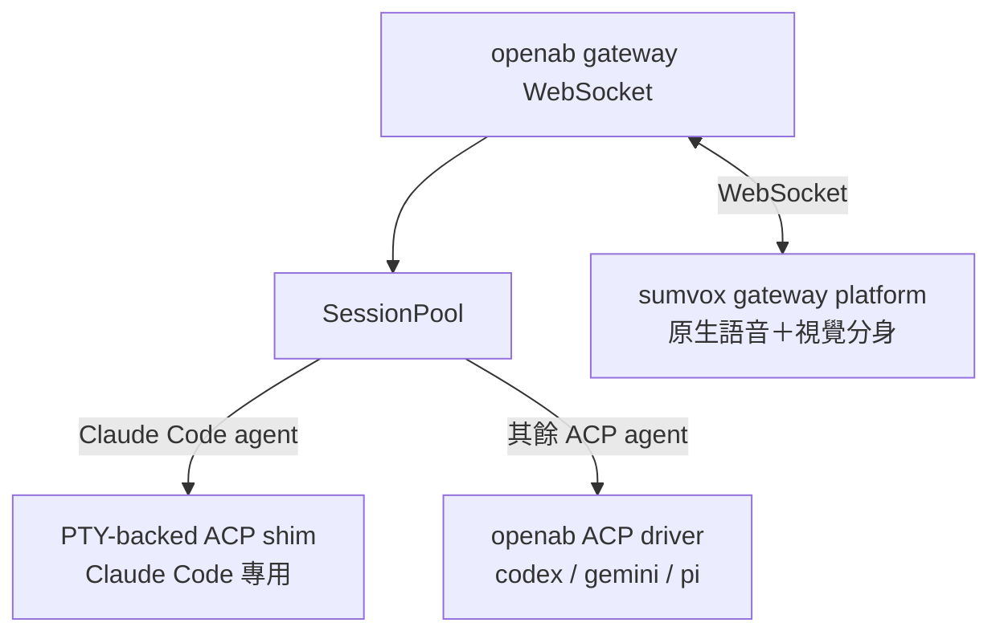

# openab Aggregator — 原生語音＋視覺分身架構設計

> **取代聲明**：本文件以 openab 為 aggregator 核心，取代 agent-aggregator.md 的 SumVox-daemon 框架。
> 舊文件（`agent-aggregator.md`）已標記 superseded，本文件為現行設計基準。

---

## 架構 A 雙驅動器

openab 是語言中立的 ACP broker，依 agent 類型路由：**Claude Code** → 獨立 PTY-backed **ACP shim**（從 cc-mobile PTY 層抽出，吃互動式訂閱額度）；**codex / pi / gemini 等** → openab 既有 ACP driver（直連 subprocess）。openab **零改動**。

**SessionPool** 管理每個 agent subprocess 生命週期，`src/acp/connection.rs:261` 負責 spawn。Claude Code 因需互動式 TUI 訂閱模式，從 SessionPool 拆出走 shim 路線；codex/pi/gemini 走既有 ACP driver，SessionPool 無需感知差異。



---

## shim 機制：PTY-backed ACP shim

shim 對 openab 呈現標準 **ACP** 介面（**stdio JSON-RPC**），openab 視之為一般 ACP agent。shim 內部以 **PTY** 驅動互動式 `claude`（無 `-p`），藉此吃完整訂閱額度。

實作重用 cc-mobile PTY 層：`pty-driver.ts`（PTY spawn + `SpawnerFn.write` **keyboard 注入**）、`tui-readiness.ts`（stripAnsi + **TUI** 就緒偵測）、`pty-reader.ts`（JSONL transcript tail，偵測 end_turn）。新建 ACP JSON-RPC 外殼：實作 `session/new`、`session/prompt`、`set_config_option`。

**流程**：ACP `session/new` → spawn PTY `claude --session-id UUID` → 等待 TUI 就緒 → `session/prompt` 到達 → `SpawnerFn.write` **注入** prompt + `\r` → JSONL poll 至 end_turn → 回傳 ACP reply。`set_config_option` 傳遞初始設定（`connection.rs:511`）。權限請求走 PreToolUse hook + permission relay，非 TUI y/n inject。

---

## 計費與脆弱點

**計費政策（查證日 2026-06-15）**：`claude -p` / Agent SDK / `--output-format stream-json` 歸 Agent SDK **月額度**（Max ~$100–200，獨立月桶）；互動式 TUI（無 `-p`）吃完整**訂閱**額度。PTY shim 走「無 `-p` 互動式 TUI」，故**吃訂閱**。來源：https://code.claude.com/docs/en/headless.md、https://support.claude.com/en/articles/15036540-use-the-claude-agent-sdk-with-your-claude-plan

**脆弱點**：(1) **ANSI** 錨定 — readiness handshake 靠 TUI 固定字樣，**改版**即可能破壞偵測；(2) **turn 邊界**（turn boundary） — JSONL poll 與 PTY 輸出 timing 需對齊；(3) **spinner / 權限框** — TUI 動態 spinner 與 ACP timeout 協調未決；(4) session 長壽模型（cc-mobile ADR-011 標記未決）。

---

## 契約：sumvox 作為 openab gateway platform

**sumvox** 實作 openab 的 `GatewayAdapter` 介面，連上 openab **gateway** **WebSocket**，openab **零改動**。

`gateway.rs:18` 定義 `GatewayEvent`（上行 uplink schema）；`gateway.rs:76` 定義 `GatewayReply`（下行 downlink schema）；`schema.rs`（`gateway/src/schema.rs`）為權威 schema 定義（schema 字串 `openab.gateway.event.v1` / `openab.gateway.reply.v1`）。

**上行（uplink）GatewayEvent 欄位**（`gateway.rs:18`，`schema.rs`）：

```
event_id      string
platform      "sumvox"
channel       { id, channel_type, thread_id }
sender        { id, name, ... }
content       string
```

**下行（downlink）GatewayReply 欄位**（`gateway.rs:76`，`schema.rs`）：

```
reply_to      string
platform      "sumvox"
channel       { id, ... }
content       { type, text }
command       optional
request_id    string
```

`GatewayAdapter`（`gateway.rs:133`）實作 `ChatAdapter` trait，把非 Discord/Slack 平台抽象化；sumvox 實作此 adapter 接入，openab 核心無需任何修改（零改動）。

---

## 痛點一：多 session 語音重疊

openab 與 PTY-daemon 已原生支援多 session 並行（SessionPool 一 thread 一 subprocess）。**語音重疊不是 session 管理問題**，是原生 interface 側 TTS 序列化問題。

解法：gateway-sumvox 側實作單一 TTS consumer，所有 session 的語音輸出統一進入序列化佇列，可沿用 SumVox `src/queue.rs`（含 `flock` 跨行程鎖）的 `NotificationQueue`。多 session 由 openab 管理，TTS 序列化由 queue.rs + flock 保證單一 consumer，兩層職責分離。

---

## 痛點二：人不在漏聽（present / absent）

presence 偵測由**視覺分身**（macOS 選單列 app / 分身端）負責，依 present/absent 狀態決定 render policy：

- **present**（人在）→ 本機 **TTS** 即時播放
- **absent**（人不在）→ 留存訊息 + **cc-mobile** **push** 推送

presence 偵測：macOS idle timer / screen lock 事件 → 切換旗標 → 通知 sumvox gateway。**cc-mobile push-to-device sink** 是否支援推送到裝置標記為 **needs-investigation**（cc-mobile 目前以 WebSocket + PTY 為主，push notification 路徑尚未確認）。

absent 路徑需留存機制（ring buffer 或持久佇列）避免訊息遺失。

---

## 決策紀錄

**決策 A 混合驅動**：Claude Code 走 PTY-backed **ACP shim**，其餘 agent 走 openab 原生 ACP driver。後果：**cc-mobile PTY 層升格**為核心基礎設施（非次要工具）；openab 零改動。設計為**語言中立**（language-neutral），不綁 Rust 或 Swift；shim 可用任何能操作 PTY 的語言。

**決策 B PTY shim 重用 cc-mobile PTY 層**：PTY transport、readiness handshake、JSONL end-turn 偵測、permission relay 直接重用；新建 ACP JSON-RPC 外殼。後果：減少重工，但 shim 與 cc-mobile 實作耦合，cc-mobile 改版需同步更新。

**決策 C 語言中立設計**：架構文件只定職責與契約，不綁實作語言。後果：sumvox gateway adapter 可用 Rust 或獨立行程，升格與切換彈性高。

**未決（needs-investigation）**：**cc-mobile** push-to-device sink（痛點二 absent 路徑）；turn boundary 協調（PTY poll timeout 與 ACP RPC frame 對齊）；session 長壽模型 orphan reaper 與斷線存活（繼承自 cc-mobile ADR-011）；readiness 改版風險（TUI 錨定字樣漂移）。

---

## 審查備註與已知缺口（turn 2 獨立審查，動工前須處理）

本文件經 spiral turn 2 獨立審查並由決策者拍板收尾為「方向性討論稿」。以下為查證後的已知缺口，**「openab 零改動」一句須讀作「有條件成立」**：

- **「openab 零改動」部分不實（H2）**：openab 目前僅支援單一 `[agent]` 後端（`openab/config.toml.example:50`、`AcpConnection::spawn` at `src/acp/connection.rs:261`），**無依 agent 類型路由到不同 driver 的機制**。要同時掛 PTY shim（Claude Code）與原生 ACP driver（codex/gemini…），openab **需新增多後端路由**——非零改動。替代解：shim 作為 openab 唯一 agent 後端（則「其餘 agent 走 openab」須另解）。
- **權限自動核准（H1）— 決策者已接受**：openab ACP 層對任何 `session/request_permission` 自動回 `allow_always`（`src/acp/connection.rs:47-75, 185-206`）。決策者裁定**自動核准可接受**：痛點二的目標是「統一管理互動方式（單一入口看/對話所有 session）」，非逐動作人工審批。故非阻塞，但互動 UX 設計應以此為前提。
- **痛點一未真正解決（H3）**：`SumVox/src/queue.rs:84-104` 的 `NotificationQueue` 是**非阻塞互斥鎖、搶不到即丟棄通知**（EWOULDBLOCK timeout → skip），**不是排隊全播的序列化佇列**。多 session 語音重疊需**新建真正的序列化播放層**（明確 drop vs 全播語意），不能直接沿用 queue.rs。
- **契約對齊（H4/H5）**：gateway schema 欄位表須對齊真實 `openab/gateway/src/schema.rs:6-81`（補必填 `schema`/`timestamp`/`event_type`/`message_id`/`mentions`、`sender.display_name`/`is_bot`、`content` 為物件含 `attachments`；reply 補 `schema`/`quote_message_id`）。ACP method 全名為 `session/set_config_option`，並須實作 `initialize` 握手（`connection.rs:457/524`）。
- **session 長壽為阻斷級前置（H6）**：cc-mobile `docs/adr/011-pty-sdk-hook-hybrid.md:85-104` 明示 session 長壽模型是「端到端可用的前置依賴」，非平行待辦。shim 動工前須先定案 connection pool + orphan reaper + 斷線存活。
- **認證與 persona 狀態缺席（H7）**：sumvox↔openab 認證應沿用 gateway token 機制（`openab/src/gateway.rs:557-566`）；「視覺分身 persona 狀態」與 presence 的 single source of truth 尚未設計。
